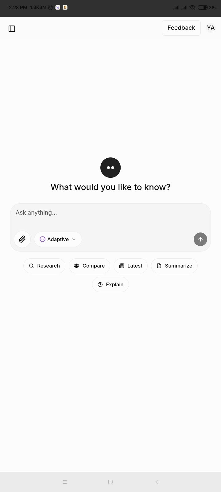
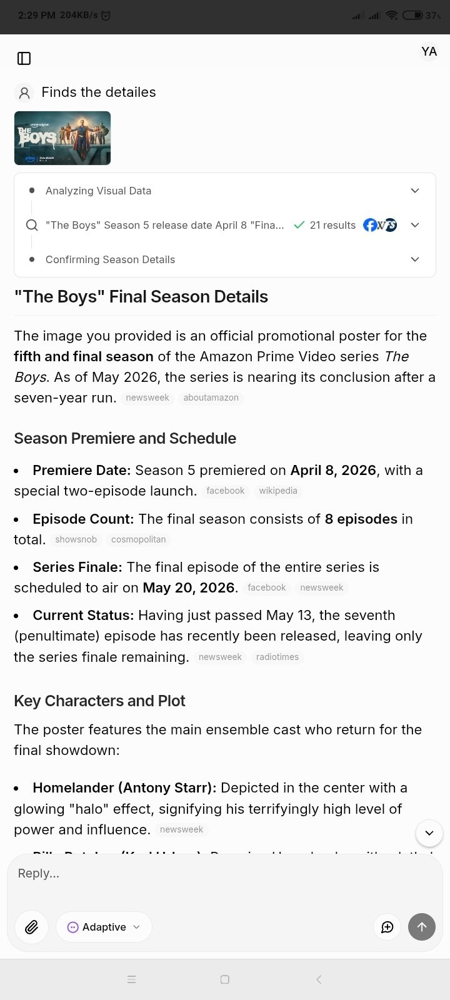
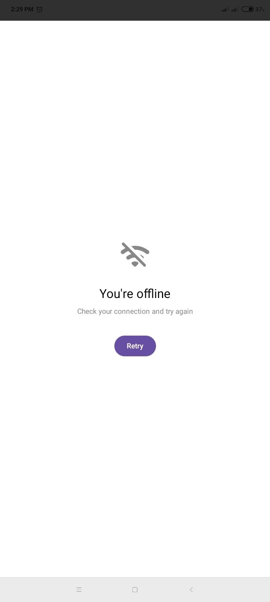

# MorphicAI for Android

A native Android wrapper for [chat.morphic.sh](https://chat.morphic.sh) — an open-source AI answer engine that combines web search with language models. Built with Kotlin and Jetpack Compose.

   

---

## Screenshots

| Home | Search Result | Offline |
|------|--------------|---------|
|  |  |  |

---

## What it does

Opens the Morphic chat interface as a native Android app. No browser chrome, no address bar — just the chat. Previous conversations persist between sessions because the app keeps the site's own cookies and storage intact. If you lose connection, you get a clean offline screen instead of Android's broken-page error.

## Features

- WebView with JavaScript and DOM storage enabled
- Session persistence — chat history survives app close and reopen
- Shimmer skeleton loading screen while the page initializes
- Offline detection with a centered error screen and retry button
- Keyboard-aware layout so the chat input stays visible when typing
- Hardware-accelerated rendering
- Back navigation works through the WebView's own history

## Tech stack

| Layer | Library |
|---|---|
| Language | Kotlin |
| UI | Jetpack Compose + Material3 |
| Web rendering | Android WebView |
| Architecture | Single Activity |

## Requirements

- Android 7.0+ (API 24)
- Android Studio Ladybug (2024.2.1) or newer
- Internet connection for new queries

## Setup

```bash
git clone https://github.com/mr-10/morphicAI.git
```

Open in Android Studio, wait for Gradle sync, then run on a device or emulator.

No API keys. No backend setup. The app talks to `chat.morphic.sh` directly.

## Build APK

**Build → Build Bundle(s) / APK(s) → Build APK(s)**

Output path:
```
app/build/outputs/apk/debug/app-debug.apk
```

## How session persistence works

The WebView keeps `domStorageEnabled` and `databaseEnabled` on, and never clears cookies on launch. The site stores its own chat history in the browser's local storage — the app just makes sure that storage survives between sessions. `onPause()` and `onResume()` are wired to the WebView lifecycle so the page doesn't reload when you switch apps.

## Project structure

```
app/
└── src/main/
    ├── java/com/example/morphicai/
    │   └── MainActivity.kt
    ├── res/
    └── AndroidManifest.xml
```

## Contributing

Pull requests are welcome. Open an issue first if you want to discuss a change.

## License

MIT — see [LICENSE](LICENSE) for details.
